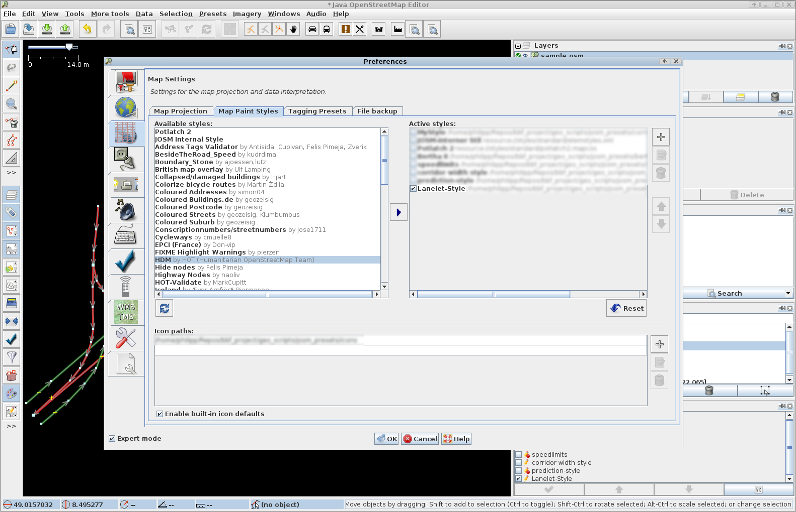
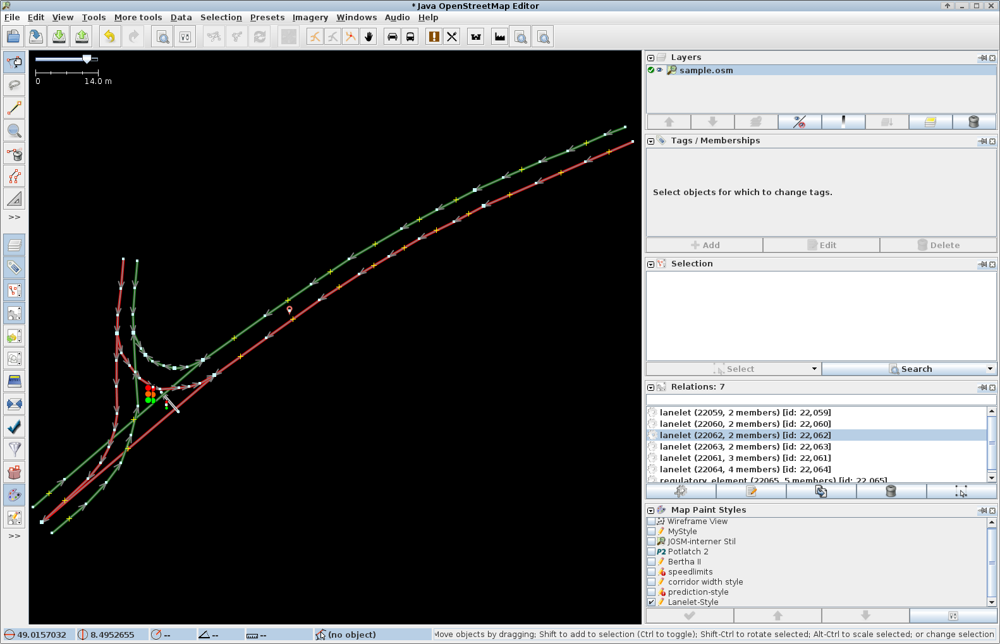

============================
Lanelet maps: ``libLanelet``
============================

:author: Philipp Bender ``<pbender@fzi.de>``, Julius Ziegler ``<ziegler@fzi.de>``
:date: April 16, 2014

.. image:: img/lanelet.png

Lanelet maps [#laneletpaper]_ have been introduced in the context of the autonomous
completion of the Bertha-Benz-Memorial-Route in 2013 [#presse]_.

The lanelet concept includes a map specification as well as an editing
tool chain. The lanelet maps are built on top of

* ``libLanelet`` (provided here)
* the OpenStreetMap (OSM) file format [#osmformat]_
* JOSM, the Java OSM editor [#josm]_
* The RAILS port, which provides the OSM server [#rails]_
* ``osmosis`` to retrieve bigger portions of the map from the database [#osmosis]_

All components are open source so that users can profit from lanelet maps immediately.

Warning: Although the infractructure of OSM plays a key role in this toolchain, lanelet maps *are not* and *will never* be part of the OSM data base. So please *do not* upload your maps to the official OSM data base - instead, use the RAILS port and set up your own server where you can host your maps.

``libLanelet``
==============

``libLanelet`` is a library which

* parses OSM XML files
* builds the lanelet map
* provides access to the attributes of lanelets and regulatory elements
* allows routing through the graph
* is released under the terms of the GNU General Public License version 3 or later [#gpl]_.

Quickstart
==========

* `Download libLanelet <lanelets_iv_2014.tar.gz>`_
* Follow the install instructions given in the ``README`` file (especially about the depedencies) and `this video <http://youtu.be/K2GKEDoe7ck>`_:
* Make a map and parse it with libLanelet (there is `a video <http://youtu.be/284xfabEUZ4>`_ as well)  
* Use ``libLanelet`` in your software. A good point to start is ``demo.cpp`` as well as the test cases in ``lanelet_tests.cpp``.
    
Configuring JOSM
================

Additionally, the archive contains
a JOSM style file as well as the corresponding icons. To activate the style,

* press ``F12`` to get into the configuration dialog
* in the third tab (titled *settings for the map projection*), go to *Map Paint Styles* and press the ``+`` to add the style sheet. In the area below, append the icon directory to the list.

  The dialog to activate the style sheet.

  A screenshot of JOSM. The coloring scheme of the bounds is consistent with the paper: red for left bounds, green
  for right bounds.
  
Don't forget to configure JOSM to use your OSM server instead of the official one.

Common pitfalls
===============

The thing with the OSM-IDs
  JOSM does not know about global IDs. So when you create new elements, they will have a negative ID which indicates that the element is not known
  to the OSM server (*your* server). As soon as this element is uploaded, the server will assign a globally unique ID which is stable at least
  during the element's life. Until then, JOSM displays 0 as ID unless you hange `osm-primitives.showid.new-primitives` to `true` in ``Preferences`` / ``[x] Expert mode`` / ``Advanced Preferences``.

The thing with the node identity
  Points (or better *nodes*) are considered identical if they have the same ID. It is not sufficient to place two different points near each other. Usually
  this causes trouble with lanelet adjacency.

Why not use the OSM server?
  OSM refers to two things: the collected data and the agreement of the community on how to map and what to map, and the infrastructure part, which is the file format, the tile structure, editing software and the database. Lanelet maps build on top of the infrastructure part. They are meaningless to OSM mappers and uploading your maps to official OSM servers will cause trouble.

Contributors
============

P. Bender, J. Ziegler, D. Nienhüser, E. Ward

References
==========

.. [#laneletpaper] P. Bender, J. Ziegler and C. Stiller: *Lanelets: Efficient Map Representation for Autonomous Driving*, submitted to *IEEE Intelligent Vehicles Symposium (IV)*, 2014.
.. [#presse] http://www.kit.edu/besuchen/pi_2013_13901.php
.. [#osmformat] http://wiki.openstreetmap.org/wiki/OSM_XML
.. [#josm] https://josm.openstreetmap.de/
.. [#rails] https://wiki.openstreetmap.org/wiki/The_Rails_Port
.. [#osmosis] http://wiki.openstreetmap.org/wiki/Osmosis
.. [#gpl] http://gplv3.fsf.org/
